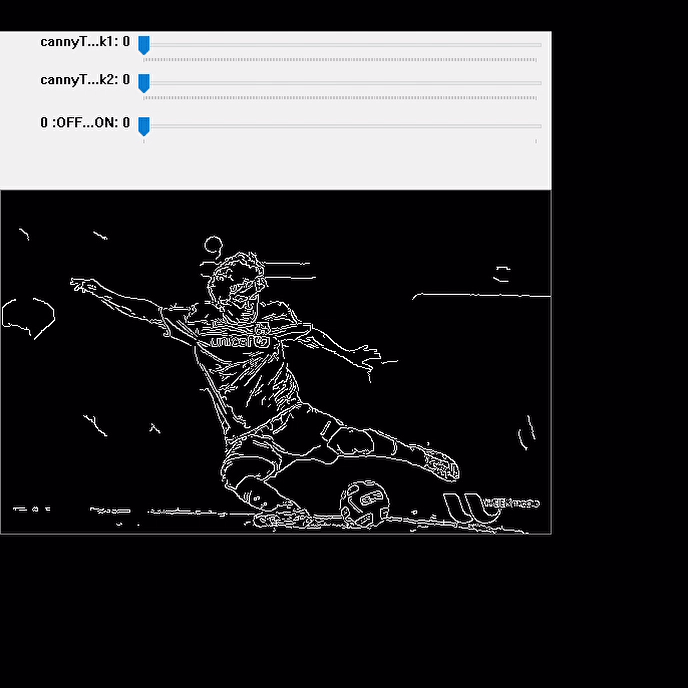

# Edge Detection 
---

### Table of Contents
You're sections headers will be used to reference location of destination.

- [Demo](#demo)
- [Overview](#overview)
- [How To Use](#how-to-use)
- [Tool Used](#tool-used)
- [Author Info](#author-info)

---

### Demo

---

### Overview

This app is created to detect all the edges in a photo or we can use it to detect edges in live video with the help of OpenCV library in which a method called Canny Edge Deytection.

### How To Use

## How to get the API key?

You can simply download the code though zip download option or clone or fork the repo then run it in your favourite IDE or Notebooks and play with trackbars which are the parameter of the Canny function.

### References
1.Google
2.OpenCV Api doccumentation

---

### Tool Used

---

### Author's Info

- Twitter - [@taronic777](https://twitter.com/taronic777)
- linkedIn - [Tarun Yadav](https://www.linkedin.com/in/tarun-yadav-47442112b/)

[Back To The Top](#read-me-template)
